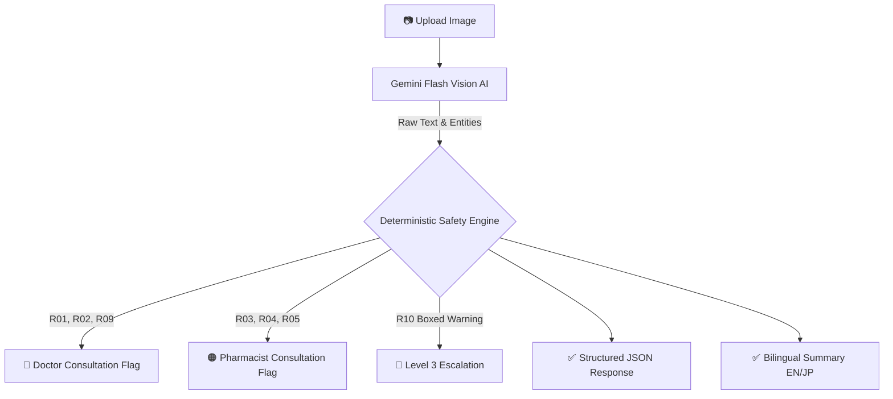

# 💊 KusuriCheck

**Product:** A medicine and supplement sheet scanner for Japan. Users scan OTC medicine boxes, prescription instruction sheets, or supplement labels and get plain Japanese/English explanations for dosage timing, warnings, ingredient conflicts, and "when to avoid."

**Use case:** Japan has an aging population and a strong consumer health market, so people often deal with dense medical instructions, small print, and uncertainty around safe usage. A product like this works because it is a label-reading pattern, but with higher trust requirements and more structured explanation logic.

**Disclaimer:** KusuriCheck is **not** a doctor, pharmacist, or diagnostic tool. It never recommends a dose and never invents content that is not visible on the label. Always consult a healthcare professional for medical advice.

---

## 🌟 Key Features

- **Bilingual Translation & Extraction:** Uses advanced vision-language models (Gemini) to extract and translate complex Japanese medical Kanji into clear, structured English.
- **Audience Modes:** Tailor the AI's summary tone to your needs:
  - **Standard:** Balanced medical translation.
  - **Simple:** Plain, everyday language avoiding complex medical jargon.
  - **Caregiver:** Emphasizes safe administration, dosage limits, and warnings.
- **Personalized Caution Profiles:** Select your specific risk factors (Pregnant, Child, Elderly, Liver/Kidney issues) before scanning. The app's deterministic safety engine actively checks extracted warnings against your profile and highlights critical alerts if a match is found.
- **100% Privacy-First:** No accounts required. No databases. Images are processed in-memory and are never stored. The application is completely stateless.

## 🧑‍🤝‍🧑 Use Cases

- **Tourists in Japan:** Catching a cold or getting a headache while visiting Japan? Easily translate complex drugstore medicine boxes to find out exactly what they treat and how to take them.
- **Expatriates & Residents:** Understand prescription instruction sheets given by local pharmacies.
- **Caregivers & Parents:** Safely navigate age restrictions and dosage requirements when administering Japanese medicine to children or elderly family members.

---

## 🚀 How to Use

1. **Upload or Snap a Photo:** Take a clear photo of the medicine box, label, or instruction sheet.
2. **Set Preferences (Optional):** Choose your preferred Audience Mode or select any Caution Profiles that apply to you.
3. **Analyze:** The app processes the image in seconds.
4. **Review Results:** Read the bilingual summary, check the dosage instructions, and review any highlighted safety warnings or pharmacist consultation flags.

---

## 🏗️ Architecture & Tech Stack

This project is structured as a pnpm monorepo consisting of two main services:

- **Frontend (`artifacts/kusuricheck/`):** React + Vite SPA built with TypeScript, Tailwind CSS, and shadcn/ui. Communicates with the backend through a shared OpenAPI contract.
- **Backend (`artifacts/api-server/`):** Python 3.11 + FastAPI server. Entirely stateless with no database. Requires a Gemini API key for OCR and analysis.

### 🔄 The Pipeline



### Deterministic Safety Engine (R01–R10)
KusuriCheck uses a hardcoded, deterministic rule engine that cannot be overridden by the LLM.

| Rule | Trigger                                           | Effect                |
| ---- | ------------------------------------------------- | --------------------- |
| R01  | "処方箋医薬品" / "要処方" markers                  | Doctor flag           |
| R02  | "劇薬" / "毒薬" wording                           | Doctor flag           |
| R03  | Pregnancy/breastfeeding restriction + profile    | Pharmacist flag       |
| R04  | Pediatric restriction + profile                  | Pharmacist flag       |
| R05  | Liver / kidney / elderly caution + profile       | Pharmacist flag       |
| R06  | Confidence < 0.4                                 | Low-confidence warn   |
| R07  | Dosage section missing                           | "Do not assume" warn  |
| R08  | Document type unclear                            | Pharmacist flag       |
| R09  | Serious side-effect / 副作用 / 重篤 wording      | Doctor flag           |
| R10  | Boxed warning ("【警告】", "重要な基本的注意")    | Level 3 Escalation    |

**Escalation levels:**
- `0` — Calm informational
- `1` — Pharmacist suggested
- `2` — Doctor suggested
- `3` — Sections suppressed; "we cannot safely summarize" fallback. (Triggered by R10 alone, R01+R02 together, or R08+R06 together).

---

## 💻 Local Development

### Environment Variables
Create a `.env` file in `artifacts/api-server/` with the following:

| Variable          | Required | Default                       | Notes                              |
| ----------------- | -------- | ----------------------------- | ---------------------------------- |
| `GEMINI_API_KEY`  | **yes**  | None                          | Required for core OCR functionality|
| `APP_ENV`         | no       | `development`                 | `production` enables JSON logs     |
| `LOG_LEVEL`       | no       | `INFO`                        |                                    |
| `MAX_UPLOAD_MB`   | no       | `10`                          | Per-file upload limit              |

### Option 1: Docker (Recommended)
A `docker-compose.yml` is provided for running the full stack easily.

```bash
GEMINI_API_KEY=your_key_here docker compose up --build
```
The web app will be available at `http://localhost:8080` and proxies `/api/*` to the backend.

### Option 2: Manual Execution

**Backend (Python):**
```bash
cd artifacts/api-server
pip install -r requirements.txt
uvicorn app.main:app --reload
```
*Backend runs on http://localhost:8000*

**Frontend (Node.js):**
```bash
cd artifacts/kusuricheck
pnpm install
pnpm dev
```
*Frontend runs on http://localhost:8080 (proxies to 8000)*

## ⚠️ What KusuriCheck will not do
- Diagnose conditions.
- Recommend doses beyond what is literally written on the label.
- Suggest alternative medicines.
- Replace a pharmacist or doctor.
- Persist any user data — every request is entirely stateless.
